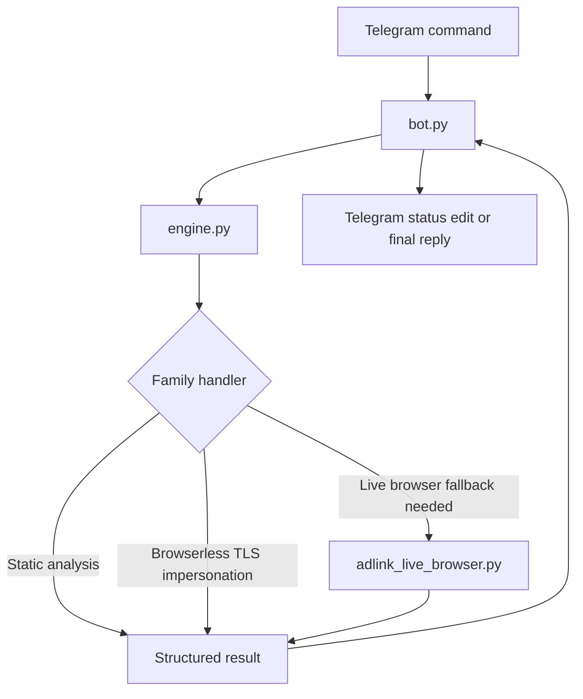
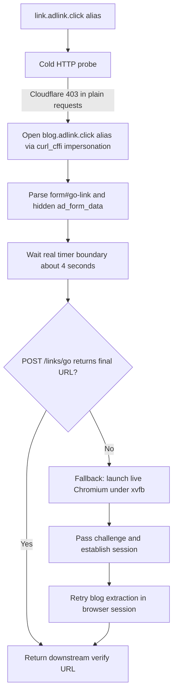
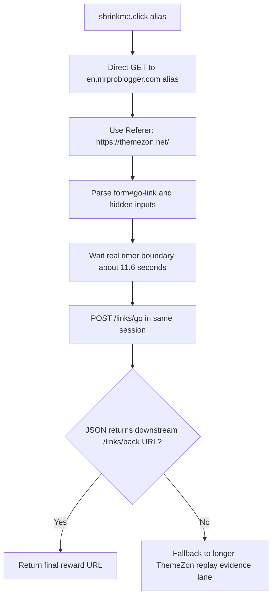

# Flows

## High-level architecture

## Adlink live lane

## Current Adlink success oracle

A run is treated as successful only when the rendered blog page exposes the final downstream target, typically through:

- `a.get-link`
- `form.go-link`
- hidden `ad_form_data`
- final reward-site verify URL such as `.../member/shortlinks/verify/...`

Intermediate article pages and bare `https://adlink.click/` landings are not treated as success.

## ShrinkMe fast lane

